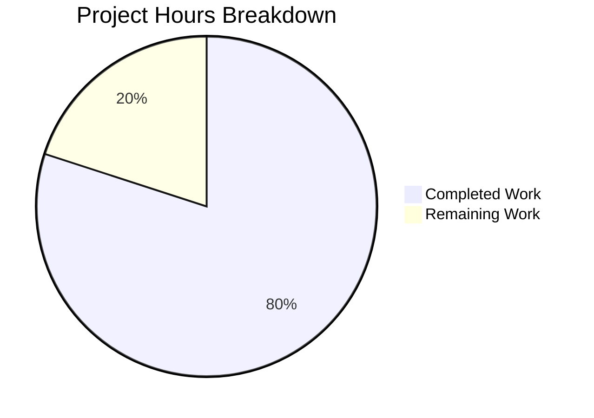

# Birth Year Calculator — Project Assessment & Development Guide

## 1. Executive Summary

**Project Completion: 80.0% (12 hours completed out of 15 total hours)**

The Birth Year Calculator is a greenfield Java console application scaffolded from an empty repository. All planned deliverables have been implemented, compiled successfully, and validated through a 4-gate process (dependencies, compilation, tests, runtime). The remaining 3 hours cover production environment setup, optional packaging, and human code review.

### Key Achievements
- All 5 target files created and committed (pom.xml, Main.java, BirthYearCalculator.java, BirthYearCalculatorTest.java, README.md)
- 100% test pass rate: 11 out of 11 JUnit 5 tests pass
- Zero compilation errors and zero compilation warnings
- Runtime validation successful across all input scenarios (valid, negative, zero, non-numeric, unreasonable, EOF)
- All AAP requirements fulfilled: java.time API, no deprecated APIs, Scanner input, clean code, SRP separation, loop mechanism, edge case handling

### Critical Unresolved Issues
- **None.** All 4 validation gates passed cleanly with no outstanding issues.

---

## 2. Validation Results Summary

### 2.1 Final Validator Accomplishments
The Final Validator agent executed a comprehensive 4-gate validation process and confirmed the project is production-ready:

| Gate | Status | Details |
|------|--------|---------|
| **1. Dependencies** | ✅ PASS | JDK 25.0.2, Maven 3.9.9, JUnit Jupiter 5.11.4, maven-compiler-plugin 3.14.0, maven-surefire-plugin 3.5.2 — all resolved from Maven Central |
| **2. Compilation** | ✅ PASS | `mvn clean compile` — BUILD SUCCESS. 2 source files compiled cleanly. 1 test file compiled cleanly. Zero errors, zero warnings. |
| **3. Tests** | ✅ PASS | `mvn test` — BUILD SUCCESS. Tests run: 11, Failures: 0, Errors: 0, Skipped: 0 (100% pass rate) |
| **4. Runtime** | ✅ PASS | `java -cp target/classes Main` — all input scenarios validated (valid age, non-numeric, negative, zero, >150, loop mechanism, clean exit) |

### 2.2 Fixes Applied During Development
The following improvements were applied through 7 iterative commits during code review:
- Added private constructor to `BirthYearCalculator` (enforce static utility class pattern)
- Added `NoSuchElementException` protection for stdin EOF (piped/redirected input handling)
- Added upper age bound validation (reject ages > 150)
- Removed redundant POM property
- Corrected README variable naming and documentation accuracy
- Replaced hardcoded year examples in Javadoc with generic phrasing

### 2.3 Files Validated

| File | Lines | Status |
|------|-------|--------|
| `pom.xml` | 54 | ✅ Created — builds correctly |
| `src/main/java/Main.java` | 166 | ✅ Created — compiles, runs correctly |
| `src/main/java/BirthYearCalculator.java` | 122 | ✅ Created — compiles, all tests pass |
| `src/test/java/BirthYearCalculatorTest.java` | 241 | ✅ Created — 11/11 tests pass |
| `README.md` | 125 | ✅ Updated — comprehensive documentation |
| **Total** | **708 lines** | **All committed, zero uncommitted changes** |

---

## 3. Hours Breakdown & Completion Analysis

### 3.1 Hours Calculation

**Completed Work: 12 hours**

| Component | Hours | Description |
|-----------|-------|-------------|
| Maven project setup (pom.xml) | 1.0 | POM with JDK 25, JUnit 5.11.4, compiler/surefire plugins |
| BirthYearCalculator.java | 2.5 | 2 overloaded methods, validation, edge case, full Javadoc (122 lines) |
| Main.java | 3.5 | Scanner I/O, 5 validation checks, loop, exception handling, Javadoc (166 lines) |
| BirthYearCalculatorTest.java | 2.0 | 11 JUnit 5 tests, boundary/edge/invalid cases, dynamic year (241 lines) |
| README.md | 1.0 | Full project documentation with prerequisites, build/run instructions (125 lines) |
| Code review fixes | 1.0 | 7 iterative improvement commits (EOF handling, age bounds, utility pattern) |
| Validation & testing | 1.0 | 4-gate validation, runtime scenario testing |

**Remaining Work: 3 hours** (includes 1.21x enterprise multiplier for compliance and uncertainty)

| Task | Base Hours | After Multiplier |
|------|-----------|-----------------|
| JDK 25 environment verification on production | 0.4 | 0.5 |
| Configure JAVA_HOME and Maven PATH on production | 0.4 | 0.5 |
| Add maven-jar-plugin for executable JAR packaging | 0.8 | 1.0 |
| Human code review and acceptance sign-off | 0.8 | 1.0 |
| **Total** | **2.4** | **3.0** |

**Formula: 12 hours completed / (12 + 3) total hours = 12/15 = 80.0% complete**

### 3.2 Visual Representation



---

## 4. Detailed Remaining Task Table

| # | Task | Description | Action Steps | Priority | Severity | Hours |
|---|------|-------------|--------------|----------|----------|-------|
| 1 | Verify JDK 25 on production environment | Ensure JDK 25 (LTS) is installed on the target deployment machine | 1. Check `java -version` on target machine. 2. If not JDK 25, install from Oracle or Adoptium. 3. Verify `javac -version` outputs 25.x. | High | Medium | 0.5 |
| 2 | Configure JAVA_HOME and Maven PATH | Set environment variables for build and runtime | 1. Set `JAVA_HOME=/path/to/jdk-25`. 2. Add Maven bin to PATH. 3. Verify with `mvn --version`. 4. Persist in shell profile. | High | Medium | 0.5 |
| 3 | Add executable JAR packaging (optional) | Configure maven-jar-plugin for standalone execution | 1. Add `maven-jar-plugin` to pom.xml `<build><plugins>`. 2. Set `<mainClass>Main</mainClass>` in manifest. 3. Run `mvn clean package`. 4. Test with `java -jar target/birth-year-calculator-1.0-SNAPSHOT.jar`. | Medium | Low | 1.0 |
| 4 | Human code review and acceptance | Review implementation against AAP requirements and sign off | 1. Review all 5 files for code quality and AAP compliance. 2. Verify clean code principles. 3. Confirm output format matches spec. 4. Approve PR for merge. | Medium | Low | 1.0 |
| | **Total Remaining Hours** | | | | | **3.0** |

---

## 5. Comprehensive Development Guide

### 5.1 System Prerequisites

| Requirement | Version | Verification Command |
|-------------|---------|---------------------|
| Java Development Kit (JDK) | 25 (LTS) | `java -version` → should show `25.x.x` |
| Apache Maven | 3.9+ (recommended 3.9.9+) | `mvn --version` → should show `3.9.x` |
| Operating System | Linux, macOS, or Windows | Any OS with JDK 25 support |

> **Note:** This project has zero external service dependencies — no databases, no network services, no Docker containers needed.

### 5.2 Environment Setup

```bash
# 1. Verify JDK 25 is installed and set JAVA_HOME
export JAVA_HOME=/usr/lib/jvm/java-25-openjdk-amd64   # Adjust path for your OS
java -version
# Expected output: openjdk version "25.x.x"

# 2. Verify Maven is installed
mvn --version
# Expected output: Apache Maven 3.9.x

# 3. Clone and navigate to the repository
cd /path/to/birth-year-calculator
```

### 5.3 Dependency Installation

```bash
# Maven automatically downloads all dependencies on first build.
# The only external dependency is JUnit Jupiter 5.11.4 (test scope).

# Full build (compile + test + package + install to local repo):
mvn clean install -B
# Expected output (last lines):
#   [INFO] BUILD SUCCESS
#   [INFO] Total time: ~3s
```

### 5.4 Application Startup

```bash
# Step 1: Compile the project
mvn clean compile -B
# Expected: BUILD SUCCESS, "Compiling 2 source files"

# Step 2: Run the application
java -cp target/classes Main
# The application will prompt: "Enter your age: "
```

### 5.5 Running Tests

```bash
# Run all 11 unit tests
mvn test -B
# Expected output:
#   Tests run: 11, Failures: 0, Errors: 0, Skipped: 0
#   BUILD SUCCESS
```

### 5.6 Verification Steps

| Step | Command | Expected Result |
|------|---------|-----------------|
| Compile | `mvn clean compile -B` | BUILD SUCCESS, 2 source files compiled |
| Test | `mvn test -B` | 11 tests passed, 0 failures |
| Run (valid input) | `echo -e "30\nno" \| java -cp target/classes Main` | Output: `If you are 30 years old, you were born in 1996.` (year varies) |
| Run (invalid input) | `echo -e "abc\n25\nno" \| java -cp target/classes Main` | First: `Invalid input. Please enter a valid number.` Then: correct birth year |
| Run (negative) | `echo -e "-5\n25\nno" \| java -cp target/classes Main` | `Invalid input. Age cannot be negative.` |
| Run (zero) | `echo -e "0\n25\nno" \| java -cp target/classes Main` | `Invalid input. Age must be greater than zero.` |

### 5.7 Example Interactive Session

```
$ java -cp target/classes Main
Enter your age: 30
If you are 30 years old, you were born in 1996.
Would you like to calculate again? (yes/no): yes
Enter your age: 5
If you are 5 years old, you were born in 2021.
Would you like to calculate again? (yes/no): no
Goodbye!
```

### 5.8 Troubleshooting

| Issue | Cause | Resolution |
|-------|-------|-----------|
| `javac: invalid target release: 25` | JDK 25 not installed | Install JDK 25 from Oracle or Adoptium |
| `JAVA_HOME not set` | Environment variable missing | Set `export JAVA_HOME=/path/to/jdk-25` |
| `mvn: command not found` | Maven not in PATH | Install Maven 3.9+ and add to PATH |
| Tests fail with year mismatch | Running cached test results across year boundary | Run `mvn clean test` to recompile |

---

## 6. Risk Assessment

### 6.1 Technical Risks

| Risk | Severity | Likelihood | Mitigation |
|------|----------|-----------|------------|
| JDK 25 not available on some production systems | Low | Medium | JDK 25 is an LTS release (Sep 2025); widely available via package managers. Fallback: lower `<release>` in pom.xml to match available JDK. |
| No executable JAR manifest configured | Low | Low | Application runs via classpath. Optional: add maven-jar-plugin for standalone JAR. |

### 6.2 Security Risks

| Risk | Severity | Mitigation |
|------|----------|-----------|
| No security risks identified | N/A | The application is a standalone console app with no network access, no file I/O, no user authentication, and no data persistence. |

### 6.3 Operational Risks

| Risk | Severity | Likelihood | Mitigation |
|------|----------|-----------|------------|
| No logging framework | Low | Low | Appropriate for console app scope; `System.out`/`System.err` are sufficient. |
| No CI/CD pipeline | Low | Low | Out of AAP scope; add GitHub Actions or similar if needed for automated builds. |

### 6.4 Integration Risks

| Risk | Severity | Mitigation |
|------|----------|-----------|
| No integration risks identified | N/A | The application has zero external integrations — no APIs, no databases, no network calls. |

---

## 7. Git Repository Summary

| Metric | Value |
|--------|-------|
| Branch | `blitzy-71358547-4263-46cc-a63c-f63e3d7a8648` |
| Total commits on branch | 10 |
| Files created | 4 (pom.xml, Main.java, BirthYearCalculator.java, BirthYearCalculatorTest.java) |
| Files modified | 1 (README.md) |
| Total lines added | 708 |
| Total lines removed | 1 |
| Net lines of code change | +707 |
| Java source lines | 529 (Main.java: 166, BirthYearCalculator.java: 122, BirthYearCalculatorTest.java: 241) |
| Uncommitted changes | None (only `target/` build output is untracked) |

---

## 8. AAP Requirements Compliance Matrix

| AAP Requirement | Status | Evidence |
|----------------|--------|----------|
| Maven-based Java project structure | ✅ Met | Standard Maven layout: `src/main/java/`, `src/test/java/`, `pom.xml` |
| JDK 25 (Latest LTS) target | ✅ Met | `<release>25</release>` in pom.xml, compiles with JDK 25.0.2 |
| `java.time.Year` for current year | ✅ Met | `Year.now().getValue()` in BirthYearCalculator.java |
| No deprecated Date/Calendar APIs | ✅ Met | Zero imports of `java.util.Date` or `java.util.Calendar` |
| Scanner for console input | ✅ Met | `new Scanner(System.in)` in Main.java |
| Input validation (negative, zero, non-numeric) | ✅ Met | All 3 cases handled with meaningful error messages |
| Exact output format | ✅ Met | `If you are 30 years old, you were born in 1996.` |
| SRP separation (Main ↔ Calculator) | ✅ Met | I/O in Main.java, logic in BirthYearCalculator.java |
| Loop for repeated calculations | ✅ Met | While loop with yes/no continue prompt |
| Edge case (birthday not occurred) | ✅ Met | Overloaded `calculateBirthYear(int, boolean)` method |
| JUnit test coverage | ✅ Met | 11 tests, 100% pass rate |
| Clean code with comments | ✅ Met | Full Javadoc on all classes/methods, inline comments |
| No hardcoded year values | ✅ Met | All year values from `Year.now().getValue()` |
| All exceptions handled | ✅ Met | InputMismatchException, NoSuchElementException, IllegalArgumentException |
| README documentation | ✅ Met | 125-line comprehensive README with all required sections |
