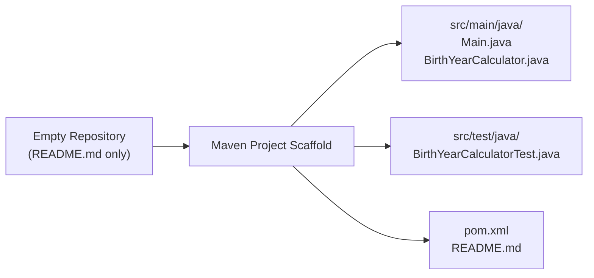

# Technical Specification

# 0. Agent Action Plan

## 0.1 Intent Clarification


### 0.1.1 Core Refactoring Objective

Based on the prompt, the Blitzy platform understands that the refactoring objective is to **scaffold a complete, new Java console application** — the **Birth Year Calculator** — within a currently empty repository that contains only a placeholder `README.md`. This is a **greenfield project creation** using a Maven-based Java project structure, applying clean code principles from inception.

- **Refactoring type**: Code structure | Modularity (creating a well-structured project from scratch with separated concerns)
- **Target repository**: Same repository (the existing empty repository will receive the full project scaffold)
- **Primary goal**: Create a Java console application that calculates a user's birth year based on the age entered, using the modern `java.time` API and `java.util.Scanner` for console input
- **Implicit requirements identified**:
  - The project must be fully self-contained and buildable via Maven with no external service dependencies
  - All calculation logic must be encapsulated in a dedicated reusable class (`BirthYearCalculator`), separate from the entry point (`Main`)
  - Input validation must be robust: reject negative numbers, zero, and non-numeric input without crashing
  - The current year must never be hardcoded — it must always be derived from `java.time.Year.now()` or `java.time.LocalDate.now()`
  - Deprecated `Date` and `Calendar` APIs must not be used
  - All exceptions must be explicitly handled — no unhandled exceptions permitted
  - Unit tests using JUnit are listed as optional but should be included to ensure quality

### 0.1.2 Technical Interpretation

This refactoring translates to the following technical transformation strategy:

- **Current state**: An empty repository with a single placeholder `README.md` containing only the heading `# 25Feb_1`
- **Target state**: A fully functional Maven-based Java console application with proper separation of concerns, comprehensive input validation, and JUnit test coverage

**Architecture transformation**:



**Transformation rules and patterns applied**:
- **Single Responsibility Principle**: `Main.java` handles user interaction (I/O), `BirthYearCalculator.java` handles calculation logic
- **Defensive Programming**: All user inputs are validated before processing; `InputMismatchException` is caught and handled gracefully
- **Modern API usage**: Exclusively use `java.time.Year` or `java.time.LocalDate` for year retrieval — zero reliance on deprecated `java.util.Date` or `java.util.Calendar`
- **Reusability**: The calculation method in `BirthYearCalculator` is a pure function accepting age as input and returning the birth year, making it independently testable
- **Exact output format**: The result must be displayed as `If you are <age> years old, you were born in <birthYear>.`


## 0.2 Source Analysis


### 0.2.1 Comprehensive Source File Discovery

The repository was inspected using `get_source_folder_contents` at the root level. The repository is effectively empty — it contains a single file with no functional code.

**Current Repository Structure**:

```
(root)/
└── README.md          (placeholder — contains only "# 25Feb_1")
```

**Source file inventory** (exhaustive — all files in the repository):

| File Path | Type | Size / Content | Status |
|-----------|------|---------------|--------|
| `README.md` | Markdown | Single heading `# 25Feb_1` — no project documentation, no build instructions, no architecture details | To be replaced with project documentation |

### 0.2.2 Source Patterns and Analysis

Since the repository contains no Java source code, no legacy patterns, no monolithic files, and no deprecated code, the transformation is entirely additive:

- **Legacy code patterns**: None — no existing code to modernize
- **Monolithic files to split**: None — no existing large files
- **Tightly coupled modules**: None — no existing modules
- **Duplicate code locations**: None — no existing code duplication
- **Dependency manifests**: None — no `pom.xml`, `build.gradle`, or any build configuration exists
- **Test files**: None — no test infrastructure exists
- **Configuration files**: None — no application configuration exists

### 0.2.3 Source File Summary

This is a **greenfield scaffold** — every file in the target structure is newly created. The only pre-existing file (`README.md`) will be updated to reflect the new project's documentation. No source-to-source migration or code splitting is required; the entire project is created from the ground up following the user's explicit structural and functional specifications.


## 0.3 Scope Boundaries


### 0.3.1 Exhaustively In Scope

**Source transformations (new file creation)**:
- `src/main/java/Main.java` — Application entry point with console I/O loop and input validation
- `src/main/java/BirthYearCalculator.java` — Reusable calculation logic class with birth year computation method

**Test creation**:
- `src/test/java/BirthYearCalculatorTest.java` — JUnit 5 unit tests covering valid ages, edge cases, and invalid inputs

**Build configuration**:
- `pom.xml` — Maven project descriptor with JDK 25 compiler target, JUnit 5 dependency, and plugin configuration

**Documentation updates**:
- `README.md` — Replace placeholder content with full project documentation including description, build instructions, usage guide, and project structure

**Optional enhancements explicitly included per user instructions**:
- Loop mechanism allowing multiple calculations without restarting the program
- Edge case handling for birthday not yet occurred in the current year
- JUnit test coverage for the `BirthYearCalculator` class

### 0.3.2 Explicitly Out of Scope

The following items are explicitly excluded per the user's constraints and the nature of this project:

- **Spring Boot REST API version** — User mentioned this as an alternative variant; it is not part of this scope
- **Deprecated `Date`/`Calendar` APIs** — Explicitly prohibited by user constraints; only `java.time` API is permitted
- **Hardcoded year values** — The current year must always be dynamically retrieved at runtime
- **GUI or web interfaces** — This is strictly a console application
- **Database or persistent storage** — No data persistence is required
- **External service integrations** — No network calls, APIs, or third-party services
- **Multi-module Maven setup** — The project is a single-module Maven application
- **CI/CD pipeline configuration** — No `.github/workflows/`, `.gitlab-ci.yml`, or similar automation files are requested
- **Docker or containerization** — No `Dockerfile` or container orchestration is required
- **Logging frameworks** — Standard `System.out` and `System.err` are sufficient for console output


## 0.4 Target Design


### 0.4.1 Refactored Structure Planning

The target architecture follows standard Maven conventions with a clean separation between application logic, entry point, and tests. Every file and folder required for standalone operation is included.

**Target Architecture**:

```
birth-year-calculator/
├── pom.xml                                  (Maven project descriptor — JDK 25, JUnit 5 dependency)
├── README.md                                (Updated project documentation)
└── src/
    ├── main/
    │   └── java/
    │       ├── Main.java                    (Entry point — console I/O, input validation, loop control)
    │       └── BirthYearCalculator.java     (Reusable calculation logic — birth year computation)
    └── test/
        └── java/
            └── BirthYearCalculatorTest.java (JUnit 5 tests — valid ages, edge cases, invalid inputs)
```

### 0.4.2 Web Search Research Conducted

The following research was performed to inform the target design:

| Topic Researched | Finding | Source |
|-----------------|---------|--------|
| Latest stable Java LTS | JDK 25 released September 16, 2025 — latest LTS with 8-year support | oracle.com/java/technologies |
| Maven latest stable | Apache Maven 3.9.12 — latest stable GA release | maven.apache.org |
| JUnit latest stable | JUnit 5.11.x (Jupiter) — mature, widely adopted testing framework for Java | junit.org |
| maven-compiler-plugin | Version 3.14.0 — stable release compatible with Maven 3.x and JDK 25 | maven.apache.org/plugins |
| maven-surefire-plugin | Version 3.5.2 — stable release for running JUnit 5 tests under Maven | maven.apache.org/plugins |
| Java `java.time` API best practices | `Year.now().getValue()` is the idiomatic way to retrieve the current year; `LocalDate.now().getYear()` is equally valid | Oracle Java documentation |
| Scanner input validation patterns | Use `Scanner.hasNextInt()` for pre-validation or try-catch on `Scanner.nextInt()` with `InputMismatchException` handling | Java SE documentation |

### 0.4.3 Design Pattern Applications

- **Single Responsibility Principle**: `Main.java` handles all user interaction (prompting, reading input, displaying output, loop control), while `BirthYearCalculator.java` handles only the computation logic
- **Separation of Concerns**: I/O operations are completely decoupled from business logic, enabling the calculator to be tested independently without console dependencies
- **Defensive Programming**: Input validation rejects all invalid inputs (negative numbers, zero, non-numeric) with meaningful error messages before any calculation is attempted
- **Static Utility Method Pattern**: The birth year calculation method is designed as a static method on `BirthYearCalculator`, making it easily invocable without instantiation — suitable for a lightweight utility class
- **Loop-Until-Exit Pattern**: The main program uses a `do-while` or `while` loop that allows repeated calculations, with a clear exit mechanism (e.g., user types "no" or "exit" when prompted to continue)

### 0.4.4 File Design Details

**Main.java**:
- Contains the `main(String[] args)` entry point
- Creates a `Scanner` instance bound to `System.in`
- Implements a loop for repeated calculations
- Validates input: checks for non-numeric using `hasNextInt()`, checks for negative/zero values after reading
- Calls `BirthYearCalculator.calculateBirthYear(int age)` for computation
- Displays the result in the exact format: `If you are <age> years old, you were born in <birthYear>.`
- Displays meaningful error messages for invalid input
- Handles `InputMismatchException` gracefully
- Closes the `Scanner` on exit

**BirthYearCalculator.java**:
- Contains a static method `calculateBirthYear(int age)` that returns the birth year as an integer
- Retrieves the current year using `java.time.Year.now().getValue()`
- Performs the subtraction: `currentYear - age`
- Contains logic comments explaining the calculation
- May include a secondary method to handle the edge case where the user's birthday has not yet occurred this year

**BirthYearCalculatorTest.java**:
- Uses JUnit 5 (`@Test`, `assertEquals`, `assertThrows`)
- Tests valid age inputs (e.g., 25, 1, 100)
- Tests boundary conditions (e.g., age equal to current year)
- Tests the birth year not-yet-occurred edge case
- Validates that the calculation method returns the correct year for known inputs


## 0.5 Transformation Mapping


### 0.5.1 File-by-File Transformation Plan

Since the repository is a greenfield scaffold with only a placeholder `README.md`, all Java source files, the test file, and the Maven POM are newly created. The `README.md` is updated in place.

| Target File | Transformation | Source File | Key Changes |
|------------|---------------|-------------|-------------|
| `pom.xml` | CREATE | — (no source) | New Maven POM with `groupId`, `artifactId`, JDK 25 compiler configuration via `maven-compiler-plugin`, JUnit 5 Jupiter dependency, `maven-surefire-plugin` for test execution |
| `src/main/java/Main.java` | CREATE | — (no source) | New application entry point: `Scanner`-based console I/O, input validation loop rejecting negative/zero/non-numeric, call to `BirthYearCalculator.calculateBirthYear()`, formatted output, loop for repeated calculations |
| `src/main/java/BirthYearCalculator.java` | CREATE | — (no source) | New reusable calculation class: static `calculateBirthYear(int age)` method using `java.time.Year.now().getValue()`, age validation, edge case handling for birthday not yet occurred |
| `src/test/java/BirthYearCalculatorTest.java` | CREATE | — (no source) | New JUnit 5 test class: tests for valid ages, boundary conditions, edge case for birthday not yet occurred, and validation of incorrect inputs |
| `README.md` | UPDATE | `README.md` | Replace placeholder heading `# 25Feb_1` with comprehensive project documentation: project title, description, prerequisites, build instructions (`mvn clean install`), run instructions (`java -cp target/classes Main`), usage examples, project structure, and constraints |

### 0.5.2 Cross-File Dependencies

**Import relationships between target files**:

- `Main.java` imports:
  - `java.util.Scanner` — for console input
  - `java.util.InputMismatchException` — for handling non-numeric input
  - `BirthYearCalculator` — for calling the calculation method (same default package, no explicit import needed)

- `BirthYearCalculator.java` imports:
  - `java.time.Year` — for retrieving the current year via `Year.now().getValue()`

- `BirthYearCalculatorTest.java` imports:
  - `org.junit.jupiter.api.Test` — for test annotation
  - `org.junit.jupiter.api.DisplayName` — for readable test names
  - `static org.junit.jupiter.api.Assertions.assertEquals` — for value assertions
  - `static org.junit.jupiter.api.Assertions.assertThrows` — for exception assertions
  - `BirthYearCalculator` — the class under test

**Configuration dependencies**:

- `pom.xml` references:
  - `maven-compiler-plugin` with `<release>25</release>` for JDK 25 compilation
  - `junit-jupiter` dependency in `<dependencies>` section with `<scope>test</scope>`
  - `maven-surefire-plugin` for JUnit 5 test execution

### 0.5.3 Wildcard Patterns

Given the small, well-defined project scope, wildcard patterns are not necessary. All files are explicitly enumerated:

- `src/main/java/*.java` — Contains exactly 2 files: `Main.java`, `BirthYearCalculator.java`
- `src/test/java/*.java` — Contains exactly 1 file: `BirthYearCalculatorTest.java`

### 0.5.4 One-Phase Execution

The entire project scaffold — including `pom.xml`, all Java source files, the test file, and the updated `README.md` — will be created by Blitzy in a **single execution phase**. No multi-phase splitting is required or permitted. All 5 target files are delivered simultaneously as one cohesive unit.


## 0.6 Dependency Inventory


### 0.6.1 Key Private and Public Packages

All dependencies are public packages sourced from Maven Central. No private packages are required.

| Package Registry | Group ID | Artifact ID | Version | Purpose |
|-----------------|----------|-------------|---------|---------|
| Maven Central | `org.junit.jupiter` | `junit-jupiter` | 5.11.4 | JUnit 5 Jupiter aggregator — includes `junit-jupiter-api`, `junit-jupiter-engine`, and `junit-jupiter-params` for writing and executing unit tests |
| Maven Central (plugin) | `org.apache.maven.plugins` | `maven-compiler-plugin` | 3.14.0 | Compiles Java source code with JDK 25 target via the `--release 25` flag |
| Maven Central (plugin) | `org.apache.maven.plugins` | `maven-surefire-plugin` | 3.5.2 | Executes JUnit 5 tests during the Maven `test` lifecycle phase |

**Java Standard Library Modules Used** (no external dependency required):

| Module | Class | Purpose |
|--------|-------|---------|
| `java.base` | `java.util.Scanner` | Reading user input from the console (`System.in`) |
| `java.base` | `java.util.InputMismatchException` | Handling non-numeric input gracefully |
| `java.base` | `java.time.Year` | Retrieving the current year via `Year.now().getValue()` |

### 0.6.2 Dependency Updates

Since the repository has no existing dependency manifests, all dependencies are newly declared in the `pom.xml`. No migration from old dependency versions is required.

**Import configuration in `pom.xml`**:

- JUnit 5 Jupiter is declared as a test-scoped dependency
- `maven-compiler-plugin` is configured with `<release>25</release>` to target JDK 25
- `maven-surefire-plugin` is included to ensure JUnit 5 tests are discovered and executed

**External Reference Updates**:

| File | Update Description |
|------|-------------------|
| `pom.xml` | New file — full Maven project descriptor with all dependency and plugin declarations |
| `README.md` | Updated to document prerequisites (JDK 25, Maven 3.9+) and build/run commands |

### 0.6.3 Runtime and Build Environment

| Component | Version | Justification |
|-----------|---------|---------------|
| Java Development Kit (JDK) | 25 (LTS) | User specified "Latest stable version"; JDK 25 is the latest LTS release (September 2025) with 8-year Oracle Premier Support. Provides full `java.time` API support and all modern language features. |
| Apache Maven | 3.9.12 | Latest stable GA release of Maven 3.x; fully compatible with JDK 25 and all specified plugins |
| JUnit Jupiter | 5.11.4 | Stable, widely adopted JUnit 5 release; fully compatible with JDK 25 and Maven Surefire 3.5.2 |

**Environment verification notes**:
- The sandbox environment has JDK 21.0.10 and Maven 3.8.7 available. The target project is configured for JDK 25, which is the user's specified latest stable version. Build environments executing this project must have JDK 25 installed.


## 0.7 Refactoring Rules


### 0.7.1 User-Specified Rules and Requirements

The following rules are explicitly mandated by the user and must be enforced without exception:

- **Do not use deprecated `Date` or `Calendar` APIs** — Only `java.time.Year` or `java.time.LocalDate` are permitted for retrieving the current year
- **Do not allow unhandled exceptions** — Every potential exception path must be explicitly caught and handled with a meaningful error message; the program must never crash from user input
- **Do not hardcode the current year** — The year must always be retrieved dynamically at runtime using `Year.now()` or `LocalDate.now()`
- **Use `java.util.Scanner`** for input — No alternative input mechanisms (e.g., `BufferedReader`, command-line arguments) are to be used as the primary input method
- **Use clean coding principles** — Meaningful variable and method names, proper indentation, and logical code organization
- **Add comments explaining the logic** — Each major code block and method must include explanatory comments
- **Separate calculation logic into a reusable method** — The birth year calculation must reside in `BirthYearCalculator.java`, not in `Main.java`
- **Handle `InputMismatchException` properly** — When non-numeric input is entered, display a meaningful error and do not crash
- **Exact output format**: `If you are <age> years old, you were born in <birthYear>.`

### 0.7.2 Special Instructions and Constraints

- **Input validation requirements** (all must be enforced):
  - Reject negative numbers — display error message
  - Reject zero — display error message
  - Reject non-numeric input — catch `InputMismatchException`, display error message, consume invalid token from Scanner buffer
- **Optional enhancements** (included in scope per user's request):
  - Allow multiple calculations without restarting — implement a loop with continue/exit prompt
  - JUnit tests — create `BirthYearCalculatorTest.java` with comprehensive test cases
  - Edge case for birthday not yet occurred — provide handling or documentation for the ±1 year ambiguity
- **Maven project structure** must follow the standard convention exactly as specified by the user:
  - `src/main/java/Main.java`
  - `src/main/java/BirthYearCalculator.java`
  - `src/test/java/BirthYearCalculatorTest.java`
- **No package declaration** is specified by the user — files reside in the default package as indicated by the flat structure under `src/main/java/`

### 0.7.3 Quality Standards

- All public methods must have Javadoc-style comments
- Variable names must be descriptive (e.g., `userAge`, `birthYear`, `currentYear` — not `a`, `b`, `y`)
- Method names must clearly convey intent (e.g., `calculateBirthYear`, `isValidAge`)
- No magic numbers — constants should be named or derived from API calls
- The program must exit cleanly with a farewell message when the user chooses to stop

User Example (preserved exactly as provided):
```
If you are 30 years old, you were born in 1996.
```


## 0.8 References


### 0.8.1 Repository Files and Folders Searched

| Path | Type | Inspection Method | Finding |
|------|------|-------------------|---------|
| `/` (root) | Folder | `get_source_folder_contents` | Repository root contains only `README.md` — no source code, no build files, no configuration |
| `README.md` | File | `read_file` | Placeholder content: single heading `# 25Feb_1` with no substantive documentation |
| `/` (recursive) | Search | `bash find` for `.blitzyignore` | No `.blitzyignore` files found anywhere in the repository |
| `/tmp/environments_files/` | Folder | `bash ls` | No environment files provided by user |

### 0.8.2 Web Research Conducted

| Search Query | Key Finding | Source URL |
|-------------|-------------|-----------|
| Latest stable Java JDK version | JDK 25 is the latest LTS, released September 16, 2025 | oracle.com/java/technologies/java-se-support-roadmap.html |
| Maven latest stable version | Apache Maven 3.9.12 is the latest GA release | maven.apache.org/download.cgi |
| JUnit 5 latest stable version | JUnit 5.14.3 is the last 5.x release; JUnit 6.0.2 released January 6, 2026 | junit.org, github.com/junit-team/junit5 |
| maven-compiler-plugin latest version | Version 3.14.1 released September 18, 2025 for Maven 3.x | maven.apache.org/plugins/maven-compiler-plugin |

### 0.8.3 Technical Specification Sections Reviewed

| Section | Purpose of Review |
|---------|------------------|
| 1.1 Executive Summary | Understand the Blitzy platform context and reverse document generation capabilities |
| 3.1 Programming Languages | Review platform's language runtime conventions and version pinning practices |

### 0.8.4 Attachments

No attachments were provided by the user for this project. No Figma URLs, design files, or supplementary documents were referenced.

### 0.8.5 User-Provided Input Summary

The user provided a single structured prompt titled **"Birth Year Calculator (Java Console Application)"** containing:
- Project title, objective, and functional requirements
- Input validation requirements (negative, zero, non-numeric rejection)
- Technical requirements (Java latest stable, Scanner, java.time API, clean code)
- Optional enhancements (loop, JUnit tests, edge case handling)
- Expected Maven project structure (3 Java files under standard Maven layout)
- Explicit constraints (no deprecated APIs, no unhandled exceptions, no hardcoded year)


